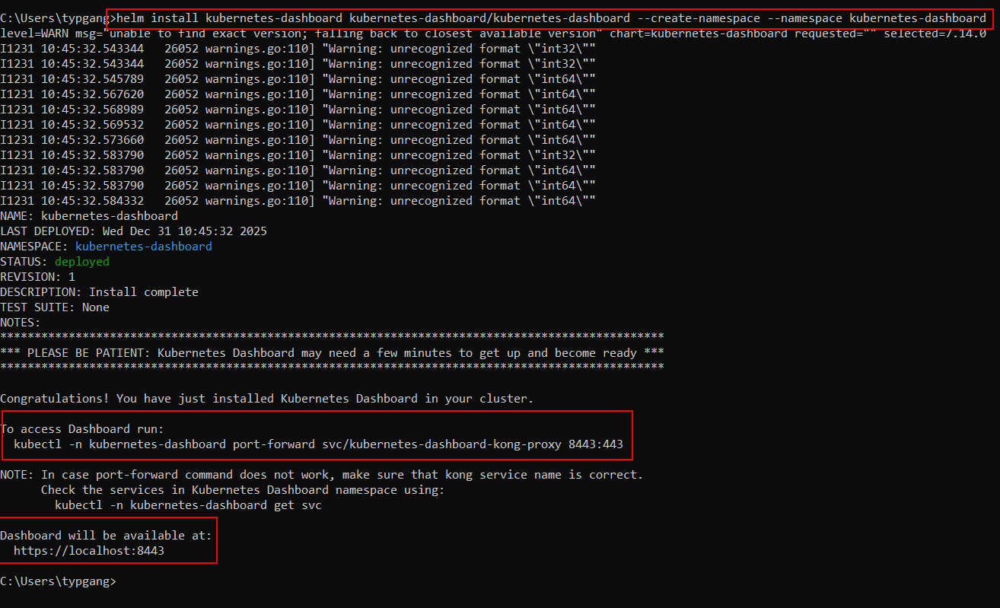
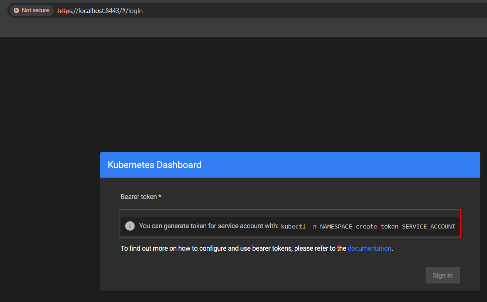
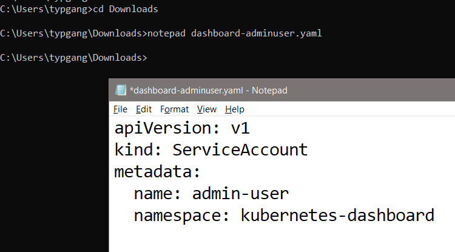
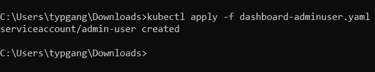
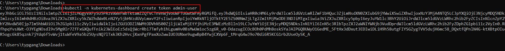
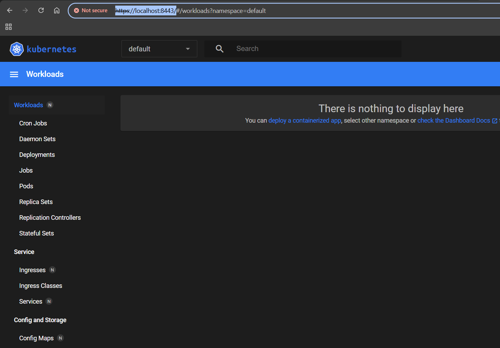
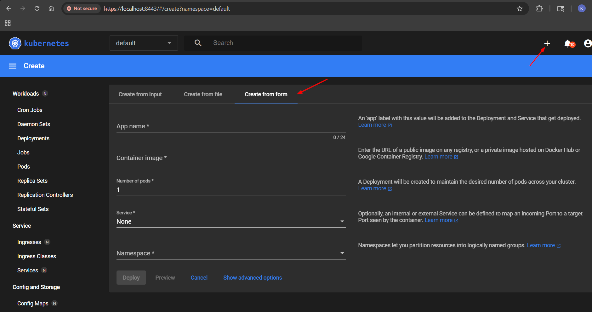

Here's a comprehensive document that guides you through creating **two Kubernetes clusters using Kind**, configuring **kubectl** to interact with them, and understanding how **Kubernetes contexts and kubeconfig** work. This can serve as a one-stop reference for future use.

---

# 📘 Setting Up Multiple Kubernetes Clusters with Kind and Managing Contexts

## 📌 Overview

This guide walks you through:
1. Creating two local Kubernetes clusters using Kind.
2. Configuring `kubectl` to interact with each cluster.
3. Understanding how Kubernetes contexts and `kubeconfig` work.
4. Switching between clusters using `kubectl`.

---

## 🛠 Prerequisites

- Docker installed and running
- `kind` installed: Install Kind
- `kubectl` installed: Install kubectl

---

## 🚀 Step 1: Create Two Kind Clusters

```bash
# Create the first cluster named 'kind-cluster1'
kind create cluster --name kind-cluster1

# Create the second cluster named 'kind-cluster2'
kind create cluster --name kind-cluster2
```

Each command creates a separate Kubernetes cluster running in Docker containers.

Example run - 

```batch
C:\Users\typgang>kind create cluster --name kind-cluster1
enabling experimental podman provider
Creating cluster "kind-cluster1" ...
 • Ensuring node image (kindest/node:v1.34.0) 🖼  ...
 ✓ Ensuring node image (kindest/node:v1.34.0) 🖼
 • Preparing nodes 📦   ...
 ✓ Preparing nodes 📦
 • Writing configuration 📜  ...
 ✓ Writing configuration 📜
 • Starting control-plane 🕹️  ...
 ✓ Starting control-plane 🕹️
 • Installing CNI 🔌  ...
 ✓ Installing CNI 🔌
 • Installing StorageClass 💾  ...
 ✓ Installing StorageClass 💾
Set kubectl context to "kind-kind-cluster1"
You can now use your cluster with:

kubectl cluster-info --context kind-kind-cluster1

Have a nice day! 👋

C:\Users\typgang>
```


---

## 🔍 Step 2: Verify Cluster Creation

```bash
# List all clusters created by Kind
kind get clusters
```

Expected output:
```
kind-cluster1
kind-cluster2
```

---

## 🧭 Step 3: Understanding kubeconfig and Contexts

### What is kubeconfig?

- `kubeconfig` is a YAML file that stores cluster connection information for `kubectl`.
- Default location: `~/.kube/config`
- It contains:
  - **clusters**: API server endpoints and certificates
  - **users**: Authentication info
  - **contexts**: A combination of cluster + user + namespace

### View current context:

```bash
kubectl config current-context
```

### List all contexts:

```bash
kubectl config get-contexts
```

### Switch context:

```bash
kubectl config use-context kind-kind-cluster1
```

---

## 🧩 Step 4: Using kubectl with Specific Clusters

After creating clusters with Kind, it automatically adds their contexts to your kubeconfig.

### Example: Get nodes from cluster1

```bash
kubectl config use-context kind-kind-cluster1
kubectl get nodes
```

### Example: Get nodes from cluster2

```bash
kubectl config use-context kind-kind-cluster2
kubectl get nodes
```

---

## 🧰 Step 5: Managing kubeconfig Files (Advanced)

If you want to keep separate kubeconfig files for each cluster:

```bash
# Export kubeconfig for cluster1
kind get kubeconfig --name kind-cluster1 > cluster1.kubeconfig

# Export kubeconfig for cluster2
kind get kubeconfig --name kind-cluster2 > cluster2.kubeconfig
```

To use a specific kubeconfig file:

```bash
kubectl --kubeconfig=cluster1.kubeconfig get nodes
```

You can also merge multiple kubeconfig files:

```bash
KUBECONFIG=~/.kube/config:cluster1.kubeconfig:cluster2.kubeconfig kubectl config view --flatten > merged.kubeconfig
```

Then set it as your default:

```bash
export KUBECONFIG=~/merged.kubeconfig
```

---

## 🧼 Step 6: Deleting Clusters

```bash
kind delete cluster --name kind-cluster1
kind delete cluster --name kind-cluster2
```

---

## 📚 Summary

| Task | Command |
|------|--------|
| Create cluster | `kind create cluster --name <name>` |
| List clusters | `kind get clusters` |
| Switch context | `kubectl config use-context <context-name>` |
| View current context | `kubectl config current-context` |
| Export kubeconfig | `kind get kubeconfig --name <name> > <file>` |
| Use specific kubeconfig | `kubectl --kubeconfig=<file> <command>` |
| Delete cluster | `kind delete cluster --name <name>` |

---

# Create Cluster with Terraform

Step by step guide to setup a cluster using terraform - [See this](./Terraform/README.md)

---

# Deploy Kubernetes dashboard

https://kubernetes.io/docs/tasks/access-application-cluster/web-ui-dashboard/

```sh
helm repo update
helm repo add kubernetes-dashboard https://kubernetes.github.io/dashboard/
helm install kubernetes-dashboard kubernetes-dashboard/kubernetes-dashboard --create-namespace --namespace kubernetes-dashboard
```





## Create admin user to login into the dashboard application

https://kubernetes.io/docs/tasks/access-application-cluster/web-ui-dashboard/#accessing-the-dashboard-ui

https://github.com/kubernetes/dashboard/blob/master/docs/user/access-control/creating-sample-user.md

**Follow the github guide**

### Create service account

Create a manifest file in anywhere in your machine and cd into that location

```yaml
apiVersion: v1
kind: ServiceAccount
metadata:
  name: admin-user
  namespace: kubernetes-dashboard
```



Apply the changes

`kubectl apply -f dashboard-adminuser.yaml`



```sh
C:\Users\typgang\Downloads>kubectl get serviceaccounts -n kubernetes-dashboard
NAME                                   SECRETS   AGE
admin-user                             0         2m43s
default                                0         148m
kubernetes-dashboard-api               0         148m
kubernetes-dashboard-kong              0         148m
kubernetes-dashboard-metrics-scraper   0         148m
kubernetes-dashboard-web               0         148m

C:\Users\typgang\Downloads>
```

### Access the token

The step to create a cluster role binding was not needed for the kind cluster - https://github.com/kubernetes/dashboard/blob/master/docs/user/access-control/creating-sample-user.md#creating-a-clusterrolebinding


Issue this command to get the bearer token - `kubectl -n kubernetes-dashboard create token admin-user`



### Use the token to access the dashboard 

use the token on https://localhost:8443/




# Why Kubernetes dashboard

This has a nice way to create resource from a form input 

