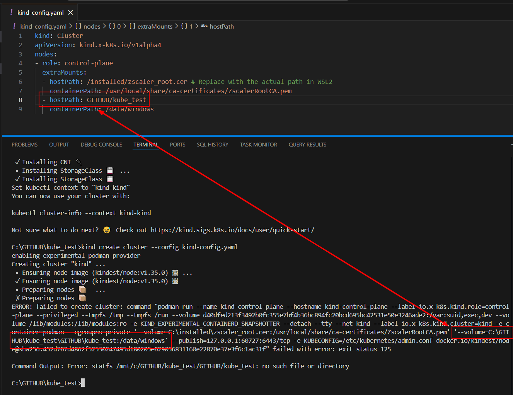

Below is a **beginner-friendly, step-by-step tutorial** that assumes **zero Kubernetes knowledge**, uses **kind**, **Podman as the container runtime**, and shows **how to persist data by mounting a directory from your Windows machine**.

I’ll explain _what_ you’re doing and _why_ at every step.

---

# Kubernetes Volumes Tutorial (from scratch)

## What you’ll learn

By the end of this tutorial, you will understand:

1. What a **Pod** is
2. What a **Volume** is and why it’s needed
3. What a **PersistentVolume (PV)** is
4. What a **PersistentVolumeClaim (PVC)** is
5. How to:

   - Mount storage into a Pod
   - Persist data even if the Pod is deleted
   - Mount a **directory from your Windows machine** into Kubernetes (via kind)

---

## Important note about Windows + kind + Podman

When using:

- **Windows**
- **Podman**
- **kind**

Your Kubernetes cluster **does NOT run directly on Windows**.
It runs **inside a Linux environment (WSL2)**.

So the flow is:

```
Windows folder
   ↓ (mounted into kind node)
kind node (Linux container)
   ↓ (hostPath)
Kubernetes Pod
```

This means:

- You **cannot** directly use `C:\something` inside Kubernetes
- You must:

  1. Mount the Windows folder into the **kind node**
  2. Use that mounted path as a PersistentVolume

We’ll do exactly that.

---

## Step 0: Verify your cluster

Make sure your cluster is running:

```bash
kubectl get nodes
```

You should see something like:

```text
NAME                 STATUS   ROLES           AGE   VERSION
kind-control-plane   Ready    control-plane   ...
```

---

## Step 1: What is a Volume? (Concept)

### Problem without volumes

A Pod is **temporary**:

- If it restarts → data is lost
- If it’s deleted → data is lost

### Solution: Volumes

A **Volume** lets data live **outside** the container.

### Persistent Volumes

For long-term storage, Kubernetes uses:

- **PersistentVolume (PV)** → the actual storage
- **PersistentVolumeClaim (PVC)** → a request for storage

---

## Step 2: Choose a Windows directory

Create a folder on your Windows machine:

```text
C:\k8s-data
```

Put a test file inside:

```text
C:\k8s-data\hello.txt
```

Content:

```text
Hello from Windows!
```

---

## Step 3: Create kind cluster with a mounted directory

You must mount the Windows directory **into the kind node**.

### Create `kind-config.yaml`

```yaml
kind: Cluster
apiVersion: kind.x-k8s.io/v1alpha4
nodes:
  - role: control-plane
    extraMounts:
      - hostPath: /k8s-data
        containerPath: /data/windows
```

> `hostPath: /k8s-data` has been mentioned as when kind takes a configuration file, it translates that to a command and it appends `c:\` to it. So `/k8s-data` becomes `c:/k8s-data`. Below is the proof with an example - 




### Why this works

- `/data/windows` is the path **inside the kind node**

---

### Create the cluster

```bash
kind create cluster --config kind-config.yaml
```

Verify:

```bash
kubectl get nodes
```

---

## Step 4: Create a PersistentVolume (PV)

Now Kubernetes needs to know about this storage.

### `pv.yaml`

```yaml
apiVersion: v1
kind: PersistentVolume
metadata:
  name: windows-pv
spec:
  capacity:
    storage: 1Gi
  accessModes:
    - ReadWriteOnce
  persistentVolumeReclaimPolicy: Retain
  hostPath:
    path: /data/windows
```

### Apply it

```bash
kubectl apply -f pv.yaml
```

### Check PV

```bash
kubectl get pv
```

Status should be:

```text
Available
```

---

## Step 5: Create a PersistentVolumeClaim (PVC)

The Pod never uses the PV directly — it asks via a PVC.

### `pvc.yaml`

```yaml
apiVersion: v1
kind: PersistentVolumeClaim
metadata:
  name: windows-pvc
spec:
  accessModes:
    - ReadWriteOnce
  resources:
    requests:
      storage: 1Gi
```

Apply:

```bash
kubectl apply -f pvc.yaml
```

Check:

```bash
kubectl get pvc
```

Status should be:

```text
Bound
```

---

## Step 6: Create a Pod that uses the volume

We’ll use a simple Linux container and mount the volume.

### `pod.yaml`

```yaml
apiVersion: v1
kind: Pod
metadata:
  name: volume-demo
spec:
  containers:
    - name: app
      image: busybox
      command: ["sh", "-c", "sleep 3600"]
      volumeMounts:
        - mountPath: /app/data
          name: storage
  volumes:
    - name: storage
      persistentVolumeClaim:
        claimName: windows-pvc
```

Apply:

```bash
kubectl apply -f pod.yaml
```

Check:

```bash
kubectl get pod
```

Status:

```text
Running
```

---

## Step 7: Verify Windows data is visible inside the Pod

### Exec into the Pod

```bash
kubectl exec -it volume-demo -- sh
```

Inside the container:

```sh
ls /app/data
```

You should see:

```text
hello.txt
```

Read it:

```sh
cat /app/data/hello.txt
```

Output:

```text
Hello from Windows!
```

✅ **Your Windows folder is now mounted into Kubernetes**

---

## Step 8: Write data from Kubernetes → Windows

Inside the Pod:

```sh
echo "Written from Kubernetes" > /app/data/from-pod.txt
exit
```

Now check on Windows:

```text
C:\k8s-data\from-pod.txt
```

It exists 🎉

---

## Step 9: Prove persistence

Delete the Pod:

```bash
kubectl delete pod volume-demo
```

Recreate it:

```bash
kubectl apply -f pod.yaml
```

Exec again:

```bash
kubectl exec -it volume-demo -- sh
ls /app/data
```

You’ll still see:

```text
hello.txt
from-pod.txt
```

✅ Data persisted even though the Pod was deleted.

---

## Mental model (important)

```
Windows Folder (C:\k8s-data)
        ↓
kind Node (/data/windows)
        ↓
PersistentVolume (PV)
        ↓
PersistentVolumeClaim (PVC)
        ↓
Pod Volume (/app/data)
```

---

## What you’ve learned

✔ What volumes solve
✔ Difference between PV and PVC
✔ How kind handles storage
✔ How to persist data across Pod restarts
✔ How to mount a Windows directory into Kubernetes

---

## Next steps (optional learning path)

If you want, next I can help you:

1. Compare `emptyDir` vs `hostPath` vs `PV`
2. Use volumes with **Deployments**
3. Use **StatefulSets**
4. Introduce **StorageClasses**
5. Visual diagrams to reinforce concepts

Just tell me how deep you want to go 🙂
